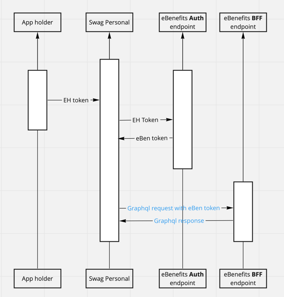

# Contributing

We want this community to be friendly and respectful to each other. Please follow it in all your interactions with the project.

**Table of content**

- [Contributing](#contributing)
  - [Development workflow](#development-workflow)
    - [Commit message convention](#commit-message-convention)
    - [Linting and tests](#linting-and-tests)
      - [Snapshot testing](#snapshot-testing)
    - [Publishing to npm](#publishing-to-npm)
    - [File and folder naming convention](#file-and-folder-naming-convention)
    - [Scripts](#scripts)
    - [Project structure](#project-structure)
    - [SVG change color programmatically](#svg-change-color-programmatically)
      - [How to use](#how-to-use)
    - [Theme (UI System)](#theme-ui-system)
  - [Backend integration](#backend-integration)
    - [Graphql codegen](#graphql-codegen)
    - [Mock server](#mock-server)
    - [Auto compress image](#auto-compress-image)

<small><i><a href='http://ecotrust-canada.github.io/markdown-toc/'>Table of contents generated with markdown-toc</a></i></small>

## Development workflow

Install node v18.13.0
**Recommend to use [nvm](https://github.com/nvm-sh/nvm?tab=readme-ov-file#installing-and-updating) as node version management tool**
and add this [auto switch node](https://github.com/nvm-sh/nvm?tab=readme-ov-file#calling-nvm-use-automatically-in-a-directory-with-a-nvmrc-file) version to your shell config file (`.bashrc`, `.zshrc`, etc) if you want

```dotenv
nvm use # switch to node version stated in .nvmrc
```

To get started with the project, run `yarn` in the root directory to install the required dependencies for each package:

```sh
yarn
```

> While it's possible to use [`npm`](https://github.com/npm/cli), the tooling is built around [`yarn`](https://classic.yarnpkg.com/), so you'll have an easier time if you use `yarn` for development.

While developing, you can run the [example app](/example/) to test your changes. Any changes you make in your library's JavaScript code will be reflected in the example app without a rebuild. If you change any native code, then you'll need to rebuild the example app.

first, you need to install the example app's dependencies and assume you're in the [root directory](../package.json) of the project:

```sh
yarn mimic
```

_It will take time for the first time, then let's drink coffee :coffee: and wait.:smile:_

To start the packager:

```sh
yarn start
```

To run the example app on Android:

```sh
yarn android
```

To run the example app on iOS:

```sh
yarn ios
```

Make sure your code passes TypeScript and ESLint. Run the following to verify:

```sh
yarn lint
```

To fix formatting errors, run the following:

```sh
yarn lint --fix
```

Remember to add tests for your change if possible. Run the unit tests by:

```sh
yarn test
```

After all, please try to build locally to make sure everything is working as expected

```sh
yarn build
```

To edit the Objective-C files, open `example/ios/SwagPersonalAppExample.xcworkspace` in XCode and find the source files at `Pods > Development Pods > react-native-swag-personal-app`.

To edit the Kotlin files, open `example/android` in Android studio and find the source files at `reactnativeswagpersonalapp` under `Android`.

### Commit message convention

We follow the [conventional commits specification](https://www.conventionalcommits.org/en) for our commit messages:

- `fix`: bug fixes, e.g. fix crash due to deprecated method.
- `feat`: new features, e.g. add new method to the module.
- `refactor`: code refactor, e.g. migrate from class components to hooks.
- `docs`: changes into documentation, e.g. add usage example for the module..
- `test`: adding or updating tests, e.g. add integration tests using detox.
- `chore`: tooling changes, e.g. change CI config.

Our pre-commit hooks verify that your commit message matches this format when committing.

### Linting and tests

[ESLint](https://eslint.org/), [Prettier](https://prettier.io/), [TypeScript](https://www.typescriptlang.org/)

We use [TypeScript](https://www.typescriptlang.org/) for type checking, [ESLint](https://eslint.org/) with [Prettier](https://prettier.io/) for linting and formatting the code, and [Jest](https://jestjs.io/) with [React Native Testing Library](https://callstack.github.io/react-native-testing-library/) for testing.

Our pre-commit hooks verify that the linter and tests pass when committing.

#### Snapshot testing

Should not be used by default
[Read more](./SNAPSHOT_TESTING.md)

### Publishing to npm

We use [sematic-release](https://github.com/semantic-release/semantic-release) to make it easier to publish new versions. It handles common tasks like bumping version based on semver, creating tags and releases etc.

More details: [Release guideline](RELEASE_GUIDELINE.md)

### File and folder naming convention

- Folders: use `kebab-naming-convention` for folder
- Files: use `UpperCamelCase` for React component. Use `camelCase` for the rest. Example
  - `PageWithBeautifulGirls`: React component
  - `useFindMyDevice`: hook

### Scripts

The `package.json` file contains various scripts for common tasks:

- `yarn build`: build the library for production.
- `yarn lint:check`: check linting across all files with ESLint.
- `yarn lint:fix`: lint files with ESLint.
- `yarn test`: run unit tests with Jest.
- `yarn mimic`: install the example app's dependencies. -> **This is a must before running the example app**
- `yarn start`: start the Metro server for the example app.
- `yarn android`: run the example app on Android.
- `yarn ios`: run the example app on iOS.

### Project structure

This project structure is feature based. Let's take a look at `src` folder. We have

```
src
|--common # things is shared accross features
|--features # feature based folder
   |--dashboard
   |--income
|--mock-server
|--navigation
|--...
```

In `common` folder and feature folder, such as `dashboard`, can have type based folder structure

```sh
common-or-feature-folder
|--components
|--libs
|--navigation
|--hooks
|--stores
|--...
```

Things are general for the whole project such as `mock-server`, `graphql`, etc, which we want to emphasize when people see this project, we can put in `src` instead of `common`

### SVG change color programmatically

This feature allows you to **modify SVG image color in runtime**. It is supported by [react-native-svg-transformer](https://github.com/kristerkari/react-native-svg-transformer), which is builtin on top of [react-svgr](https://react-svgr.com)

**Example**

```tsx
<SvgComp fill="your color" />
```

#### How to use

To make a SVG file support this feature. We need make sure 2 things

1. `fill="none"` is removed from the top of SVG file (remove if this prop exists)
2. `fill="a-color-from-design"` is removed from `<path>` or any other SVG elements you want to modify color

**Note**: after making these changes, default color of SVG file will be **black** `#000` or `#000000`

### Theme (UI System)

- Follow on [Hero Design System](https://design.employmenthero.com/mobile/guidelines/essential-guide-and-quick-reference/)

## Backend integration

This Swag Personal library interact with 2 endpoints

- [BFF](https://samnewman.io/patterns/architectural/bff/) endpoint (which is implemented using [Appsync](https://aws.amazon.com/appsync/)) - Graphql endpoint.
- eBenefits Auth endpoint - Restful endpoint

The Auth endpoint is used for getting **eBenefits token** by sending **EH token**



### Graphql codegen

This is to automatically generate react hook query, mock data based on BFF Graphql introspection schema

[Read more details about Graphql Codegen](GRAPHQL_CODEGEN.md)

### Mock server

While developing this library, mock server can be used for

- Mock BE response. App can be use without any actual BE deployment. API response can be customized as much as developers want, even mimic response with error
- Mock server can be used while app running and while jest running
- Mock both restful and graphql response

[More details about mock server](MOCK_SERVER.md)

### Auto compress image

- Automatically compress your images before commit

[More details about auto compress](AUTO_COMPRESS_IMAGE.md)
