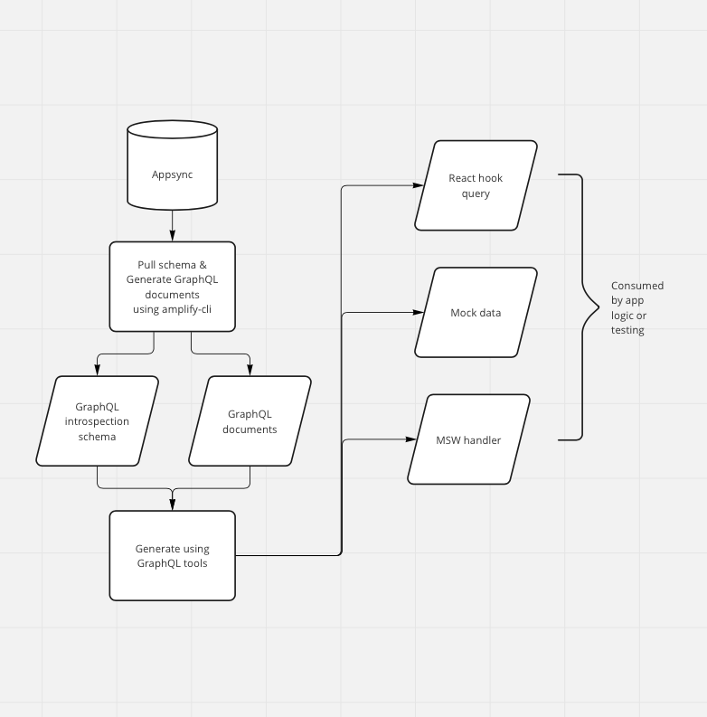

# GraphQL Codegen

This codegen includes 2 parts

- Generate GraphQL documents: pull GraphQL introspection schema from Appsync then generate GraphQL documents. This process use [amplify-cli](https://docs.amplify.aws/cli/)
- Generate query hooks, mock data, mock handler: use above GraphQL introspection schema and GraphQL documents as input to generate these things. This process use [GraphQL Code Generator](https://www.graphql-code-generator.com)



## Pull schema & Generate GraphQL documents using amplify-cli

Before we start: What is [Appsync](https://aws.amazon.com/appsync/)? What is [BFF](https://samnewman.io/patterns/architectural/bff/)? What is [amplify-cli](https://docs.amplify.aws/cli/)?

**In short**:

- Amplify is an app holder that contains Appsync.
- When running `amplify codegen`, GraphQL schema is pulled from Appsync then this file will be used to generate GraphQL documents.
- Config file for this codegen process `.graphqlconfig.yml`

### `amplify codegen`

By default, amplify will pull the latest schema.json from Appsync. Then GraphQL schema is pulled from Appsync then this file will be used to generate GraphQL documents.

Its config file is [.graphqlconfig.yml](.graphqlconfig.yml)

1. Install amplify-cli

```shell
npm install -g @aws-amplify/cli
```

2. Pull amplify project

In project root directory, run

```shell
amplify pull
```

| Question                                         | Answer                                                        |
| ------------------------------------------------ | ------------------------------------------------------------- |
| Select the authentication method you want to use | Both **AWS profile** and **AWS access keys** are working fine |
| Which app are you working on                     | EbfSwagPersonal (d1vegkbz19yqyt)                              |
| Choose your default editor                       | Select your IDE                                               |
| Choose the type of app that you're building      | typescript                                                    |
| What javascript framework are you using          | react-native                                                  |
| Source Directory Path                            | enter to use default                                          |
| Distribution Directory Path                      | enter to use default                                          |
| Build Command                                    | enter to use default                                          |
| Start Command                                    | enter to use default                                          |
| Do you plan on modifying this backend            | enter to use default                                          |

Run `amplify status` to double-check your setup is successful

If should look like this:

```shell
 % amplify status

    Current Environment: dev

┌──────────┬─────────────────┬───────────┬─────────────────┐
│ Category │ Resource name   │ Operation │ Provider plugin │
├──────────┼─────────────────┼───────────┼─────────────────┤
│ Api      │ SwagPersonalAPI │ No Change │                 │
└──────────┴─────────────────┴───────────┴─────────────────┘

GraphQL endpoint: https://lkeyuetr4vbyxhf2dhly663tbu.appsync-api.ap-southeast-2.amazonaws.com/graphql

GraphQL transformer version: 2
```

To double-check everything is working, run `amplify codegen`

### What if Appsync new GraphQL schema is not deployed to Appsync yet

When you're **developing a new feature**, the contract (new graphql schema) must be backwards compatible. If you cannot deploy the updated contract without breaking existing clients, you need to add a version number to the contract.

## `yarn graphql-codegen`

This command will generate automatically for us react hook query, mock data, MSW handler

- React hook query + MSW handler are put in [generated.ts](src/graphql/generated.ts)
- Mock data is put in [generated-mocks.ts](src/graphql/mocks/generated-mocks.ts)

Its config file is [graphql-codegen.yml](graphql-codegen.yml)

To using in E2E test, run `yarn graphql-codegen:e2e`

## What to do if something goes wrong

Hunt down the person responsible and throw them into the Snake Pit. If you don't have a Snake Pit handy, follow these steps:

BE WARNED: this will delete the old amplify instance and create a new one. Try to avoid doing this, as everyone will need to update their environment.

NOTE: The AppSync graphql server is not affected by any of these changes.

1. Delete the `amplify` directory
2. Backup this file `mv .graphqlconfig.yml .graphqlconfig.yml~`
3. Remove the old Amplify project `aws amplify delete-app ${APP_ID}` (APP_ID is the id of the Amplify project -- use `aws amplify list-apps`). There should only be one Amplify project at a time.
4. Create a new Amplify project: `amplify init`
5. Use the graphql api from another appsync: `amplify add codegen --apiId 7lksgmijmrfbdh7orwfpms3ipq` (this value is the `apiId` and comes from `aws appsync list-graphql-apis`)
6. Just accept all the defaults, because we will be overwriting the `.graphqlconfig.yml` file anyway.
7. `mv .graphqlconfig.yml~ .graphqlconfig.yml`
8. `amplify codegen`
9. cleanup `rm src/graphql/mutations.js src/graphql/queries.js`
10. `amplify push`
11. Make sure you push all the changes to the repo and merge the PR.
