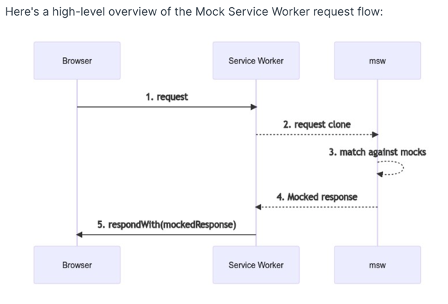

# Mock server

- Mock BE response. App can be use without any actual BE deployment. API response can be customized as much as developers want, even mimic response with error
- Mock server can be used while app running and while jest running
- Mock both restful and graphql response

## How it works

Mock server is built on top of [Mock service worker (msw)](https://mswjs.io)

When mock server runs, all request will be intercepted by msw. If the request matches any predefined mock, the mock response will be returned. Otherwise, the request will be sent to actual endpoint or an error will be thrown based on [msw config](https://mswjs.io/docs/recipes/debugging-uncaught-requests#enable-onunhandledrequest-option)



## How to use

[Detail guide about MSW](https://mswjs.io/docs/)

We are using generated mock/hook/etc for quicker and easier usage. Read more about them in [Graphql codegen](GRAPHQL_CODEGEN.md)

### Usage with jest

By default, the all handlers in `src/mock-server/handlers.ts` will handle requests of tests. If these handlers don't meet your need, you can

- Add more handlers to `src/mock-server/handlers.ts` if this handler **handles happy case** of API. See example in [Usage with example app](#Usage with example app)
- Add handlers directly to your test, if you want to test edge cases, unhappy cases, etc. This handle will only affect test in its scope. See example below

Example with custom request handler in test file

```tsx
// Import generated request handler
import { mockCurrentUserQuery } from '../../../../graphql/generated';
// Import generated mock data
import { aUser } from '../../../../graphql/generated-mock';
// mock server for jest env
import { mockServerNode as mockServer } from '../../../../mock-server/mockServerNode';

it('should render properly', async () => {
  // Add custom request handler for CurrentUserQuery if needed
  mockServer.use(
    // Add handler for your API request
    mockCurrentUserQuery((_, res, context) => {
      return res.once(context.data({ currentUser: aUser() }));
    })
  );
  // Your assertion logic ...
});
```

### Usage with example app

1. Turn mock server on

- Set `RUN_MOCK_SERVER=true` in `example/.env` file
- Rebuild the app `yarn example ios` or `yarn example android`

2. Adding/customize your request handlers for happy cases

- Graphql handlers: add new handlers to `src/graphql/handlers`
- Restful handlers: add new handlers to `src/restful/handlers`
  Handler file structure is separate by Graphql and Restful and also feature based. Handlers within same feature/subdomain should be in the same handler file
- Import new handlers to `src/mock-server/handlers.ts`

  ```tsx
  export const handlers = [
    // ...existing handlers
    ...yourNewHandlers,
  ];
  ```

### Usage with E2E testing

#### Note

- We have dedicated mock server for our E2E testing, which is automatically started. To mock query responses for your test case:

- Using handlers in your test case. Example:

```js
// test suite file
import * as mockServer from 'relative-path-to-mock-server';

describe('test suite', () => {
  it('test case', () => {
    const handlers = {
      'query InstapayUsageVerification': {
        data: {
          instapayUsageVerification: {
            memberNotUsedInstapay: false,
          },
        },
      },
    };
    mockServer.setHandlers(handlers);

    // test case implementation
  });
});
```
