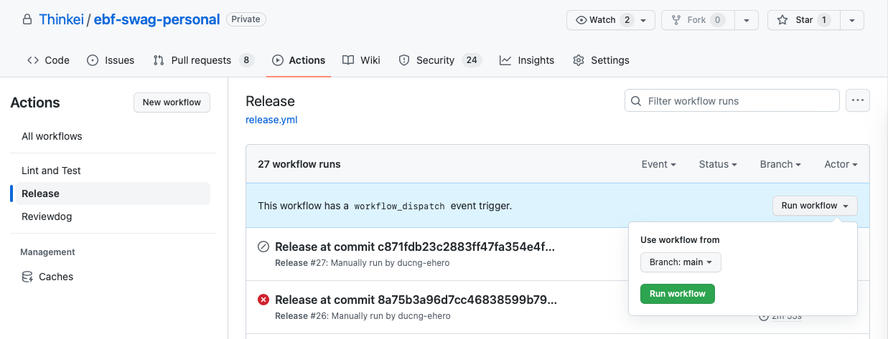
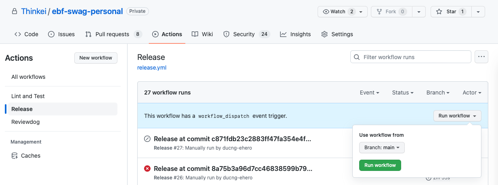
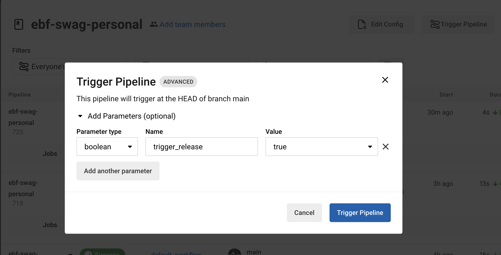

# Release guideline

The release approach is built with [semantic-release](https://github.com/semantic-release/semantic-release/)

## Table of Contents

- [Release guideline](#release-guideline)
  - [Table of Contents](#table-of-contents)
  - [Background](#background)
  - [Steps to release staging build](#steps-to-release-staging-build)
    - [2. Trigger a new build of core app with new version of our lib](#2-trigger-a-new-build-of-core-app-with-new-version-of-our-lib)
      - [Build with Codepush](#build-with-codepush)
      - [Build native app](#build-native-app)
  - [Steps to release to production](#steps-to-release-to-production)
  - [Note](#note)

---

## Background

Following the [semantic-release](https://github.com/semantic-release/semantic-release/) approach, we have 2 main branches for releasing: `main`, `_.__.x`

- `main` branch: is default and protected branch where all MRs must be targeted to. Most releases must be done from this branch.
- In case there is an issue from the official release and need to have a hotfix, `_.__.x` where `_` is filled with the previous version number, this hotfix branch should be created from `main`. Example: `1.x`, `2.12.x`

  Example

  - If current release version is `1.55.0`, and we need a hotfix. Create branch `1.55.x` and cherry-pick the hotfix to `1.55.x` and trigger release pipeline.

    Ensure that all cherry-picked commit only contain commit with commitm message starting with `fix:`. If there is commit message starting with `feat:`, [semantic-release](https://github.com/semantic-release/semantic-release/) will bump version to `1.56.0` and release will not work on this branch.

  - _What if my hotfix include commit with `feat:`?_

    In this case [semantic-release](https://github.com/semantic-release/semantic-release/) will bump minor version, hence new version will be `1.56.0`. To release this hotfix without releasing the whole main, create branch `1.56.x` instead and cherry-pick your changes.

    > **Important**
    >
    > After release, merge branch `1.56.x` to `main`. This will update version in `main` branch. If not, next release from main branch will encounter error as it tries to release the same version `1.56.0` which already exists.

For more detail, please read these documents:

- [Publishing on distribution channels](https://github.com/semantic-release/semantic-release/blob/master/docs/recipes/release-workflow/distribution-channels.md)
- [Publishing maintenance releases document](https://github.com/semantic-release/semantic-release/blob/master/docs/recipes/release-workflow/maintenance-releases.md)
- [Publishing pre-releases document](https://github.com/semantic-release/semantic-release/blob/master/docs/recipes/release-workflow/pre-releases.md)

## Steps to release staging build

1. Publish new version for our lib:
   - For releasing:
     - Via Github Actions (current pipeline):
       - Open Swag Personal App [repo](https://github.com/Thinkei/ebf-swag-personal/)
       - Open **Release** workflow on GitHub Actions tab
         
       - Trigger Release workflow on **main** branch
         
     - Via CircleCI (migrating toward):
       - Open Swag Personal App project on CircleCI [dashboard](https://app.circleci.com/pipelines/github/Thinkei/ebf-swag-personal)
       - Trigger **release** workflow on **main** branch with flag `trigger_release=true`
         
       - Make sure E2E tests are passed, then approve `hold_release` job to release
   - Get a new version name

Note: New version will be published to private npm https://www.npmjs.com/package/@ehrocks/react-native-swag-personal-app

### 2. Trigger a new build of core app with new version of our lib

#### Build with Codepush

- Checkout branch `build-money`
- Update version of our lib in `package.json`
- Commit & Push
- Go to linked pipeline (codepush_mini_app_for_testing)
- Trigger job + Approve
  - `hold_workflow`
  - `hold_codepush_mini_app_for_testing`

For more detail, see [CodePush for testing app builds](https://employmenthero.atlassian.net/wiki/spaces/PAYM/pages/2484240451/CodePush+for+testing+app+builds#How-to-deploy-a-new-version)

#### Build native app

- Checkout branch `build-money`
- Update version of our lib in `package.json`
- Commit & Push
- Go to linked pipeline (build_and_deploy)
- Trigger job + Approve
  - `hold_install_dependencies`
  - `hold_staging`

The app build will be available on App Center. Testing users will get notification for this build

## Steps to release to production

As our app is a mini-app of core app [eh-mobile-pro](https://github.com/Thinkei/eh-mobile-pro), production release is following release cycle of core app. To include your changes in release cycle, follow the steps to release in staging and open a PR to include version bump of your build, trigger the required pipeline and request approval for your PR. Example PR: https://github.com/Thinkei/eh-mobile-pro/pull/5138

---

## Note

> - Repo of core app https://github.com/Thinkei/eh-mobile-pro
> - Branch `build-money`
> - Production release PR example https://github.com/Thinkei/eh-mobile-pro/pull/5138
